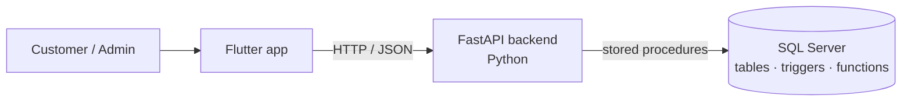

# Jaimex · E-commerce Store

A full e-commerce application backed by a relational **SQL Server** database. Customers can browse and filter products, read and write reviews, fill a shopping cart and check out in several steps, while administrators manage the catalog, offers, users and orders and see sales reports.

The front end is built with **Flutter**, connected to a **Python (FastAPI)** API that runs every database operation through **stored procedures** written in T-SQL.

Built as the second project of the **Databases I** course at the Instituto Tecnológico de Costa Rica (TEC), 2024.

> **Note:** the database is currently inactive, so the app can't load data right now. To try it, create the database from the scripts in [`DB/`](DB) on your own SQL Server instance and point the backend to it (see [Getting started](#getting-started)).


---

## Features

### For customers
- **Home page** with featured products (the best sellers) and active offers.
- **Product catalog** with search and filters by name, price, brand and category.
- **Product detail** with images, description, reviews and 1 to 5 star ratings.
- **Reviews:** registered users can write a review and rate a product.
- **Shopping cart:** add products, change quantities or remove them, with the total calculated automatically, including discounts.
- **Multi-step checkout:** shipping address, payment method and order summary, with form validations.
- **User profile:** edit personal data, addresses and payment methods.
- **Order history** with the status of every order.

### For administrators
- **CRUD screens** for products, categories, brands, offers and users.
- **Order management:** update each order's status (pending, in preparation, shipped, delivered).
- **Reports:** monthly sales, top 5 customers, sales by customer and category, and top categories.

## Database

The heart of the project is the relational model in SQL Server:

- **Tables** for users, addresses, payment methods, products, categories, brands, offers, reviews, carts, orders and order details, with primary keys, foreign keys and constraints to keep the data consistent.
- **Stored procedures** for every operation the app performs:
  - CRUD (upserts and deletes) for the main entities.
  - User registration and log-in.
  - Purchase flow: check the cart, check inventory, reduce stock, empty the cart and confirm the order.
  - Order history and order status updates.
  - Reporting queries for sales by month, by customer and by category.
- **Functions** that calculate unit prices with discounts and the cart total.
- **Triggers** that enforce business rules:
  - `trg_BloquearPedidosSinInventario` blocks orders for products without enough stock.
  - `trg_AlertaInventarioBajo` raises an alert when a product's stock drops to 10 units or fewer.

## How it works



The Flutter app never touches the tables directly. Every request goes to the FastAPI backend, which calls the matching stored procedure, so the business rules live in the database.

## Tech

| Layer | Technology |
|---|---|
| Front end | Flutter · Dart |
| Back end | Python · FastAPI |
| Database | Microsoft SQL Server · T-SQL (stored procedures, triggers, functions) |
| Version control | Git · GitHub |

## Project structure

```
ProyectoBD/
├── DB/                    # T-SQL scripts
│   ├── SP_REGISTER_LOGIN.sql
│   ├── SP_UPSERTS.sql     # create / update procedures
│   ├── SP_GETS            # read procedures and reports
│   ├── SP_COMPRA.sql      # purchase flow, inventory, order status
│   ├── DELETES.sql
│   ├── Triggers.sql
│   └── OUTCODES.txt       # return codes used by the procedures
├── inserts/               # sample data
├── jaimex_backend/        # FastAPI backend
│   ├── main.py            # API endpoints
│   └── app/               # db connection, models, functions
└── jaimex_front/          # Flutter app
    └── lib/
        ├── Pages/User/    # login, sign-up, catalog, detail, offers, order history
        ├── Pages/Admin/   # CRUD screens, orders, reports
        ├── widgets/       # cards, cart, checkout forms, header
        └── data/          # data models
```

## Getting started

### Requirements

- Microsoft SQL Server (and SQL Server Management Studio or Azure Data Studio)
- ODBC Driver 17 for SQL Server
- Python 3.10 or newer
- [Flutter SDK](https://docs.flutter.dev/get-started/install)

### 1. Create the database

Run the scripts in `DB/` on your SQL Server instance to create the tables, stored procedures, functions and triggers, then load the sample data from `inserts/`.

<!-- If the table-creation script isn't in the repo yet, add it to DB/ so others can rebuild the database. -->

### 2. Run the backend

Set your database connection in `jaimex_backend/app/db.py` (ideally through environment variables), then:

```bash
cd jaimex_backend
pip install fastapi uvicorn pyodbc pydantic
uvicorn main:app --reload
```

The API runs at `http://127.0.0.1:8000`, with interactive docs at `http://127.0.0.1:8000/docs`.

### 3. Run the Flutter app

```bash
cd jaimex_front
flutter pub get
flutter run
```

## Team

This was a team project for the Databases I course.

<!-- Add your teammates and what each person built, for example:
- **Tamara Villarevia Navarro:** product detail page, order history, user profile, ...
- **Teammate:** ...
-->

## Author

**Tamara Villarevia Navarro** · Computer Engineering student at TEC
[GitHub](https://github.com/B1bisauri0)
